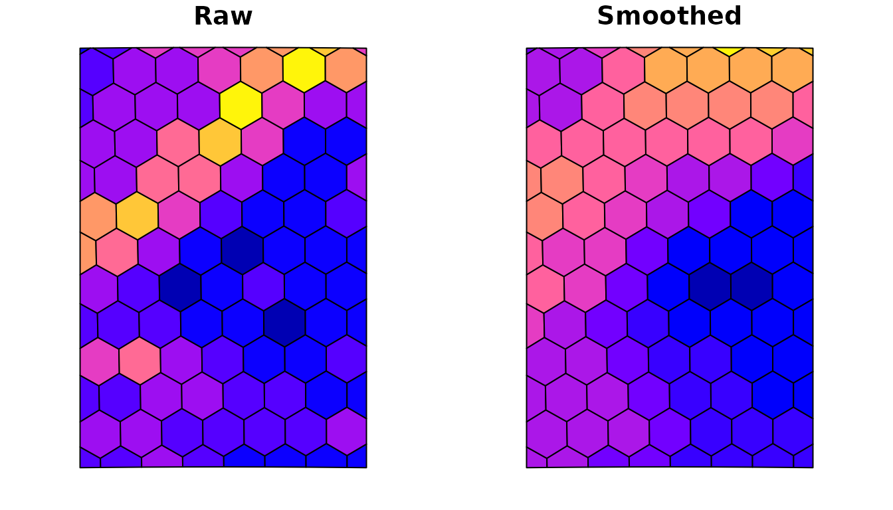

# Getting started with hexsmoothR

## What hexsmoothR does

`hexsmoothR` builds a hexagonal (or square) grid over a study area,
extracts raster values into the cells, and applies a Gaussian-weighted
spatial-smoother that uses each cell’s *N*-order neighbours. The
smoother is implemented in C++ with a pure-R fallback.

The package is intentionally small. There are four user-facing steps:

1.  [`create_grid()`](https://maxmlang.github.io/hexsmoothR/reference/create_grid.md) -
    build the grid.
2.  [`extract_raster_data()`](https://maxmlang.github.io/hexsmoothR/reference/extract_raster_data.md) -
    pull raster values into the cells.
3.  [`compute_topology()`](https://maxmlang.github.io/hexsmoothR/reference/compute_topology.md) -
    find neighbours and weights.
4.  [`smooth_variables()`](https://maxmlang.github.io/hexsmoothR/reference/smooth_variables.md) -
    apply the smoother.

Helpers
([`get_utm_crs()`](https://maxmlang.github.io/hexsmoothR/reference/get_utm_crs.md),
[`find_hex_cell_size_for_target_cells()`](https://maxmlang.github.io/hexsmoothR/reference/find_hex_cell_size_for_target_cells.md),
[`hex_flat_to_edge()`](https://maxmlang.github.io/hexsmoothR/reference/hex_flat_to_edge.md)
and friends) cover common conveniences.

## Setup

``` r
library(hexsmoothR)
library(sf)
library(terra)
```

We use the small NDVI raster shipped with the package so the vignette
runs without external data:

``` r
ndvi_path <- system.file("extdata", "default.tif", package = "hexsmoothR")
ndvi      <- rast(ndvi_path)
ndvi
#> class       : SpatRaster 
#> size        : 251, 224, 1  (nrow, ncol, nlyr)
#> resolution  : 0.008983153, 0.008983153  (x, y)
#> extent      : -5.003616, -2.99139, 38.99587, 41.25064  (xmin, xmax, ymin, ymax)
#> coord. ref. : lon/lat WGS 84 (EPSG:4326) 
#> source      : default.tif 
#> name        : NDVI
```

Build a study area from the raster’s extent:

``` r
study_area_wgs <- st_as_sf(st_as_sfc(st_bbox(ndvi)))
st_crs(study_area_wgs) <- 4326
```

## Cell-size units depend on the CRS

Cell-size units are dictated by the CRS that the grid is built in:

| Grid CRS              | `cell_size` units |
|-----------------------|-------------------|
| Projected (UTM, etc.) | metres            |
| Geographic (WGS84)    | degrees           |

For real analyses, work in a projected CRS so distances and areas are
meaningful.
[`get_utm_crs()`](https://maxmlang.github.io/hexsmoothR/reference/get_utm_crs.md)
picks an appropriate UTM zone automatically:

``` r
utm_crs        <- get_utm_crs(study_area_wgs)
study_area_utm <- st_transform(study_area_wgs, utm_crs)
utm_crs
#> [1] "EPSG:32630"
```

## Step 1: create a grid

``` r
hex_grid <- create_grid(
  study_area = study_area_utm,
  cell_size  = 25000,        # 25 km flat-to-flat
  type       = "hexagonal"
)

nrow(hex_grid)
#> [1] 98
head(hex_grid[, c("grid_id", "grid_index")])
#> Simple feature collection with 6 features and 2 fields
#> Geometry type: POLYGON
#> Dimension:     XY
#> Bounding box:  xmin: -5.003616 ymin: 38.99587 xmax: -4.859316 ymax: 41.03265
#> Geodetic CRS:  WGS 84
#>   grid_id grid_index
#> 1  grid_1          1
#> 2  grid_2          2
#> 3  grid_3          3
#> 4  grid_4          4
#> 5  grid_5          5
#> 6  grid_6          6
#>   sf..st_make_grid.study_area_proj..cellsize...grid_size..square....type....
#> 1                                             POLYGON ((-4.859316 38.9970...
#> 2                                             POLYGON ((-4.867469 39.3060...
#> 3                                             POLYGON ((-4.877938 39.6960...
#> 4                                             POLYGON ((-4.888613 40.0859...
#> 5                                             POLYGON ((-4.899497 40.4758...
#> 6                                             POLYGON ((-4.910597 40.8657...
```

If you don’t know the right cell size up front, search for one that
yields approximately a target number of cells:

``` r
target_size <- find_hex_cell_size_for_target_cells(
  study_area     = study_area_utm,
  target_cells   = 250,
  cell_size_min  = 5000,
  cell_size_max  = 100000
)
round(target_size, 0)
#> [1] 15391
```

[`create_grid()`](https://maxmlang.github.io/hexsmoothR/reference/create_grid.md)
will auto-pick a UTM CRS when `projection_crs = NULL` (the default), so
the simplest call is just:

``` r
hex_grid_wgs_input <- create_grid(study_area_wgs, cell_size = 25000)
```

## Step 2: extract raster values into cells

[`extract_raster_data()`](https://maxmlang.github.io/hexsmoothR/reference/extract_raster_data.md)
accepts either file paths or
[`terra::SpatRaster`](https://rspatial.github.io/terra/reference/SpatRaster-class.html)
objects. CRS transformations are applied automatically per raster, so
the grid and rasters do not need to share a CRS.

``` r
extracted <- extract_raster_data(
  raster_files = list(ndvi = ndvi),
  hex_grid     = hex_grid
)
str(extracted, max.level = 1)
#> List of 6
#>  $ data     :'data.frame':   98 obs. of  4 variables:
#>  $ hex_grid :Classes 'sf' and 'data.frame':  98 obs. of  4 variables:
#>   ..- attr(*, "sf_column")= chr "sf..st_make_grid.study_area_proj..cellsize...grid_size..square....type...."
#>   ..- attr(*, "agr")= Factor w/ 3 levels "constant","aggregate",..: NA NA NA
#>   .. ..- attr(*, "names")= chr [1:3] "grid_id" "grid_index" "cell_id"
#>  $ cell_size: NULL
#>  $ extent   :S4 class 'SpatExtent' [package "terra"]
#>  $ variables: chr "ndvi"
#>  $ n_cells  : int 98
head(extracted$data)
#>   cell_id         x        y      ndvi
#> 1       1 -4.941120 39.03844 0.1554499
#> 2       2 -4.943375 39.36834 0.1508328
#> 3       3 -4.947612 39.75840 0.1582167
#> 4       4 -4.952039 40.14843 0.2210585
#> 5       5 -4.956664 40.53843 0.1682958
#> 6       6 -4.961496 40.92839 0.1416744
```

The returned list contains the value table (`data`), the grid actually
used (`hex_grid`), and a bit of provenance (`cell_size`, `extent`,
`variables`, `n_cells`).

## Step 3: compute topology

[`compute_topology()`](https://maxmlang.github.io/hexsmoothR/reference/compute_topology.md)
finds the *N*-order neighbours of every cell and derives Gaussian
weights from the average inter-cell distance:

``` r
topology <- compute_topology(hex_grid, neighbor_orders = 2)
str(topology, max.level = 1)
#> List of 7
#>  $ neighbors      :List of 2
#>  $ avg_distance   : num 23303
#>  $ sigma          : num 11651
#>  $ weights        :List of 3
#>  $ grid_ids       : chr [1:98] "grid_1" "grid_2" "grid_3" "grid_4" ...
#>  $ grid_indices   : int [1:98] 1 2 3 4 5 6 7 8 9 10 ...
#>  $ neighbor_orders: int 2
```

The relevant numbers:

``` r
topology$avg_distance      # metres between neighbouring centroids
#> [1] 23302.58
topology$sigma             # bandwidth used for Gaussian decay
#> [1] 11651.29
topology$weights           # normalised centre + per-order weights
#> $center_weight
#> [1] 0.3333333
#> 
#> $neighbor_weights
#> [1] 0.3333333 0.3333333
#> 
#> $sigma
#> [1] 11651.29
```

By construction, all weights (centre + every order) sum to 1:

``` r
topology$weights$center_weight + sum(topology$weights$neighbor_weights)
#> [1] 1
```

You can override the auto-weights by passing `neighbor_weights_param`:

``` r
topo_custom <- compute_topology(
  hex_grid,
  neighbor_orders        = 3,
  neighbor_weights_param = list(0.5, 0.3, 0.1)
)
topo_custom$weights$neighbor_weights
#> [1] 0.26315789 0.15789474 0.05263158
```

## Step 4: smooth

``` r
result <- smooth_variables(
  variable_values = list(ndvi = extracted$data$ndvi),
  neighbors       = topology$neighbors,
  weights         = topology$weights
)
str(result, max.level = 2)
#> List of 1
#>  $ ndvi:List of 4
#>   ..$ raw              : num [1:98] 0.155 0.151 0.158 0.221 0.168 ...
#>   ..$ weighted_combined: num [1:98] 0.162 0.166 0.174 0.188 0.193 ...
#>   ..$ neighbors_1st    : num [1:98] 0.161 0.17 0.169 0.21 0.197 ...
#>   ..$ neighbors_2nd    : num [1:98] 0.163 0.166 0.179 0.173 0.195 ...
```

For each variable you get:

| Field                    | Meaning                                                    |
|--------------------------|------------------------------------------------------------|
| `raw`                    | The original (unsmoothed) cell value                       |
| `neighbors_<N>{st,nd,…}` | Mean of valid neighbours at order *N*                      |
| `weighted_combined`      | Gaussian-weighted average of the centre and all neighbours |

Quick noise-reduction check:

``` r
sd_raw      <- sd(result$ndvi$raw,               na.rm = TRUE)
sd_smoothed <- sd(result$ndvi$weighted_combined, na.rm = TRUE)
round(100 * (sd_raw - sd_smoothed) / sd_raw, 1)  # % SD reduction
#> [1] 33.8
```

## Plotting

Attach the smoothed columns back onto the grid and plot:

``` r
hex_grid$ndvi_raw      <- result$ndvi$raw
hex_grid$ndvi_smoothed <- result$ndvi$weighted_combined

op <- par(mfrow = c(1, 2), mar = c(2, 2, 2, 1))
plot(hex_grid["ndvi_raw"],      main = "Raw",      key.pos = NULL, reset = FALSE)
plot(hex_grid["ndvi_smoothed"], main = "Smoothed", key.pos = NULL, reset = FALSE)
```



``` r
par(op)
```

## N-order smoothing

Increasing `neighbor_orders` widens the kernel. The cost is roughly
linear in the number of orders for these small grids, but neighbour
counts grow quadratically with order, so don’t go overboard:

``` r
results_per_order <- lapply(2:4, function(k) {
  topo_k <- compute_topology(hex_grid, neighbor_orders = k)
  smooth_variables(
    variable_values = list(ndvi = extracted$data$ndvi),
    neighbors       = topo_k$neighbors,
    weights         = topo_k$weights
  )$ndvi$weighted_combined
})

sapply(results_per_order, sd, na.rm = TRUE)  # SD shrinks with order
#> [1] 0.02374635 0.01936584 0.01598182
```

## Multiple variables in one pass

[`smooth_variables()`](https://maxmlang.github.io/hexsmoothR/reference/smooth_variables.md)
processes any number of variables in a single C++ call, which is much
faster than per-variable looping:

``` r
multi <- smooth_variables(
  variable_values = list(
    ndvi          = extracted$data$ndvi,
    ndvi_squared  = extracted$data$ndvi^2
  ),
  neighbors = topology$neighbors,
  weights   = topology$weights
)
names(multi)
#> [1] "ndvi"         "ndvi_squared"
```

## Tips and gotchas

- **Always project before measuring.** If you pass a geographic-CRS
  grid, `cell_size` is in degrees, distances aren’t comparable across
  latitudes, and the topology distance estimate is meaningless. Use UTM
  or another projected CRS, or rely on the auto-detection.
- **`raw` is the input, not a smoothing output.** It’s there so you can
  carry the original value alongside the smoothed columns without an
  extra join.
- **NA propagation.** `weighted_combined` divides by the *realised*
  weight (sum of weights of non-NA contributors), so missing neighbours
  don’t bias the result towards zero - they’re simply skipped.
- **Verbose mode.** Set `options(hexsmoothR.verbose = FALSE)` in scripts
  and notebooks to silence the progress messages emitted by
  [`create_grid()`](https://maxmlang.github.io/hexsmoothR/reference/create_grid.md),
  [`compute_topology()`](https://maxmlang.github.io/hexsmoothR/reference/compute_topology.md),
  etc.
